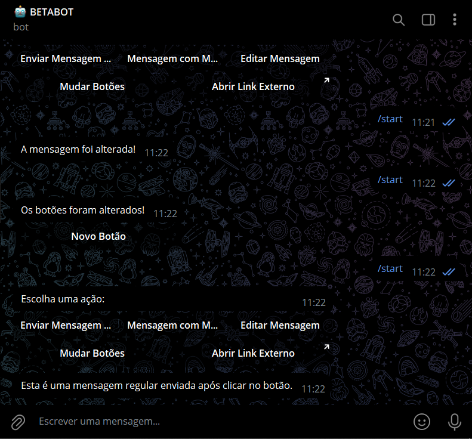

# BOT TYPES BOTOES
🤤ESTE BOT DO TELEGRAM FORNECE UMA INTERFACE INTERATIVA COM BOTÕES INLINE.

 <br>

## DESCRIÇÃO:
Este bot do Telegram, construído usando a biblioteca `telebot` (PyTelegramBotAPI), fornece uma interface interativa com **botões inline**. Cada botão realiza uma ação específica, como enviar mensagens regulares, formatadas com HTML, exibir alertas, notificações, editar mensagens e até mudar dinamicamente os botões apresentados. Ele também permite abrir links externos diretamente.

## FUNCIONALIDADES:
1. **Exibir Alerta**:
   - Exibe um pop-up tipo "alerta" com uma mensagem destacada que precisa ser fechada pelo usuário.
   
2. **Exibir Notificação**:
   - Exibe uma pequena notificação transitória (tipo toast) que desaparece automaticamente após alguns segundos.

3. **Enviar Mensagem Regular**:
   - Ao clicar no botão, uma mensagem de texto regular é enviada para o chat.

4. **Mensagem com Markdown/HTML**:
   - Envia uma mensagem formatada usando HTML. No exemplo, a mensagem é exibida com texto em **negrito** e um link clicável.

5. **Editar Mensagem**:
   - O conteúdo da mensagem original é editado e substituído por um novo texto.

6. **Mudar Botões**:
   - Substitui o conjunto de botões atuais por novos botões, criando uma interação dinâmica.

7. **Abrir Link Externo**:
   - Este botão abre uma URL externa diretamente no navegador do usuário (no exemplo, é `https://exemplo.com`).

## EXECUTANDO O PROJETO:
1. **Coloque o Token:**
   - Antes de executar o programa, é necessário substituir o token do seu bot no arquivo `TOKEN.py`, o qual pode ser obtido por meio do [@BotFather](https://t.me/BotFather).

2. **Instalando as dependências:**
   - Antes de executar o bot, certifique-se de instalar todas as dependências necessárias. No terminal, execute o seguinte comando para instalar as dependências listadas no arquivo `requirements.txt` em `CODIGO`:
   ```bash
   pip install -r requirements.txt
   ```

3. **Inicie o Bot:**
   - Execute o bot do Telegram em Python iniciando-o com o seguinte comando:
   ```bash
   python CODIGO.py
   ```

   - Ele ficará ativo aguardando comandos.
   
4. **Interação**:
   - Ao iniciar uma conversa com o bot (ou enviar o comando `/start`), o bot exibirá um teclado com vários botões inline.
   - **Escolha uma ação** clicando nos botões, e o bot realizará a ação correspondente:
     - **Enviar Mensagem Regular**: Envia uma mensagem simples no chat.
     - **Mensagem com Markdown/HTML**: Exibe uma mensagem formatada com HTML.
     - **Editar Mensagem**: Substitui o texto da mensagem original por um novo.
     - **Mudar Botões**: Troca os botões existentes por um novo conjunto de botões.
     - **Abrir Link Externo**: Abre o link `https://exemplo.com` no navegador.
   - Alguns botões, como "Exibir Alerta" e "Exibir Notificação", mostrarão pop-ups ou notificações breves no Telegram.

## NÃO SABE?
- Entendemos que para manipular arquivos em muitas linguagens e tecnologias relacionadas, é necessário possuir conhecimento nessas áreas. Para auxiliar nesse aprendizado, oferecemos alguns subsidios:
* [CURSO DE TELEBOT](https://github.com/VILHALVA/CURSO-DE-TELEBOT)
* [CURSO DE PYTHON](https://github.com/VILHALVA/CURSO-DE-PYTHON)
* [CONFIRA MAIS CURSOS](https://github.com/VILHALVA?tab=repositories&q=+topic:CURSO)

## CREDITOS:
- [PROJETO CRIADO PELO VILHALVA](https://github.com/VILHALVA)
